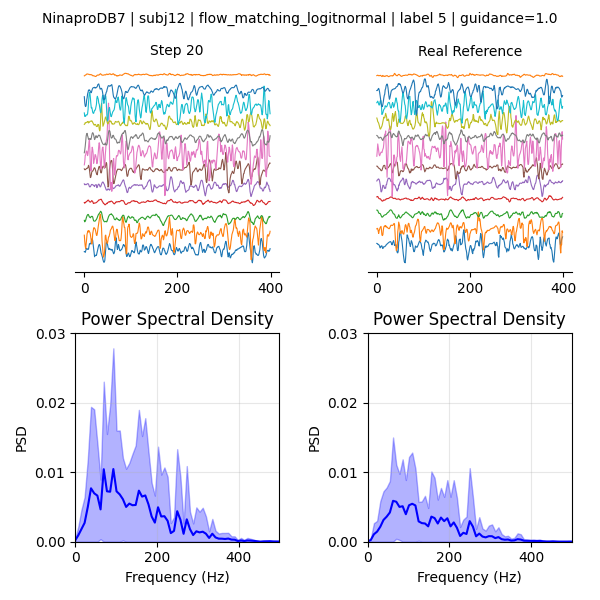
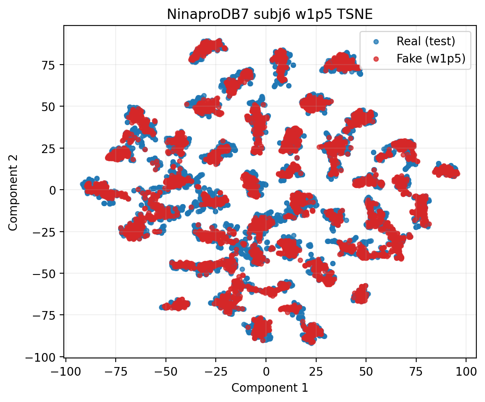

# EMGFlow Models

Minimal model-only release of the generative backbones behind **EMGFlow: Robust and Efficient Surface Electromyography Synthesis via Flow Matching**.

This branch keeps only the `emgflow/model/` source tree plus a few showcase assets. Everything else from the research workspace has been stripped away.

## Why It Is Interesting

- Conditional **Flow Matching** for sEMG generation
- Compact **DDPM / DDIM** baseline with the same 1D U-Net family
- Lightweight **WGAN-GP** generator baseline
- Shared building blocks for classifier-free guidance, EMA, attention, patch extraction, and sampling

## Visuals

Generated EMG evolution under Flow Matching:



Distribution structure in feature space:



## Included Code

```text
emgflow/
  model/
    DDPM.py
    flow_matching.py
    gan/
    utils/
```

## Quick Start

```bash
conda activate py312
pip install -e .
```

```python
from emgflow.model import DiffusionPatchEMG, PatchEMGUNet1D
from emgflow.model import FlowMatchingPatchEMG, PureWGANGenerator1D
from emgflow.model import ModelFactory
```

## Scope

This is a **model-only** branch.

It does **not** include:

- dataset loaders
- preprocessing pipelines
- fidelity package
- experiment runners
- checkpoints or cached outputs

## License

License selection has not been finalized yet.
