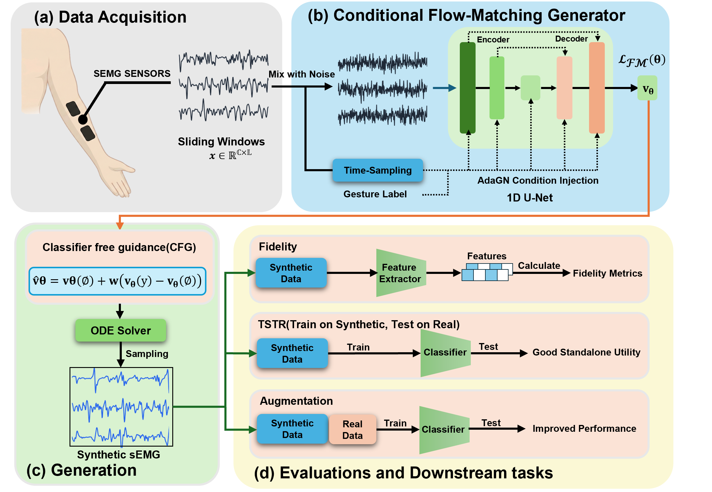
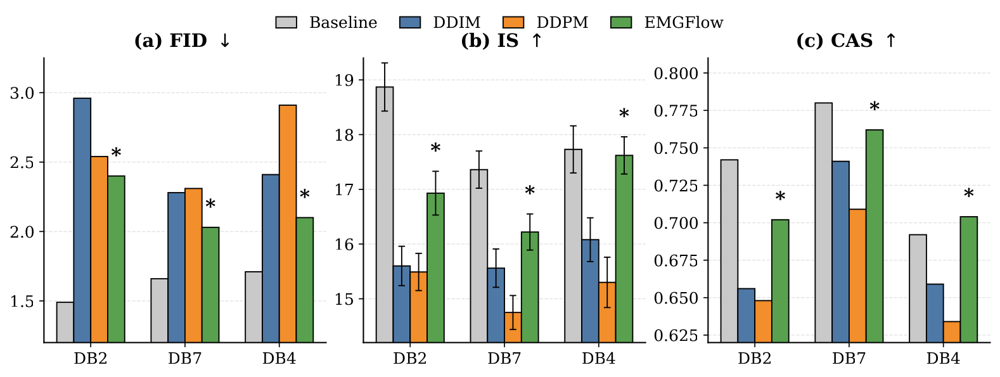
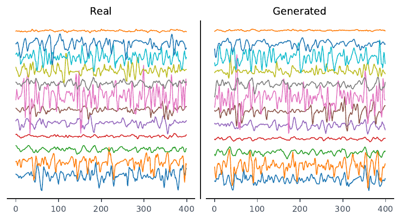
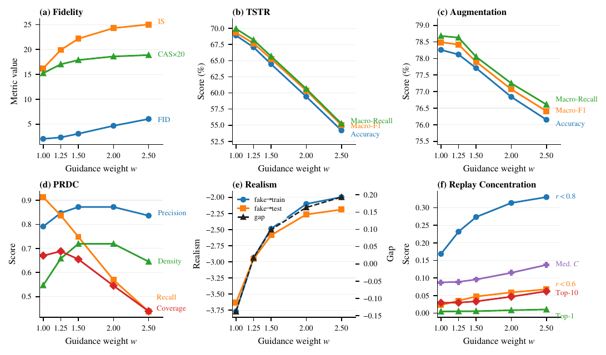

<div align="center">
<h1>EMGFlow</h1>
<h3>Robust and Efficient Surface Electromyography Synthesis via Flow Matching</h3>

Boxuan Jiang<sup>1</sup>, Chenyun Dai<sup>1 :email:</sup>, and Can Han<sup>1 :email:</sup>

<sup>1</sup> School of Biomedical Engineering, Shanghai Jiao Tong University, Shanghai, China

(<sup>:email:</sup>) Corresponding Author

</div>

> This repository contains the public model release of our paper: **"EMGFlow: Robust and Efficient Surface Electromyography Synthesis via Flow Matching"**. The current branch focuses on the core generative modeling code for surface EMG synthesis, including **EMGFlow**, **DDPM/DDIM**, and **WGAN-GP** baselines.

## Overview

**EMGFlow** is a conditional generative framework for surface electromyography synthesis. It is designed to generate class-conditioned multi-channel EMG segments efficiently while preserving waveform fidelity, class utility, and downstream augmentation value.

The released code in this repository focuses on the model layer of the paper:

- **EMGFlow** with conditional Flow Matching and ODE-based sampling
- **DDPM / DDIM** as diffusion baselines with a compact 1D U-Net backbone
- **WGAN-GP** as an adversarial baseline for generative comparison
- Shared utilities for **classifier-free guidance**, **EMA**, **attention**, **patch extraction**, and **sampling schedules**

<div align="center">

</div>

## Features

- Conditional **Flow Matching** model tailored for efficient EMG synthesis
- Reproducible **DDPM / DDIM** baselines under the same codebase
- Lightweight **WGAN-GP** baseline for adversarial comparison
- Shared 1D generative building blocks for waveform modeling research
- Compact public release that keeps the repository centered on the paper's core model contributions

## Code Structure
```text
EMGFlow/
│
├── emgflow/
│   ├── __init__.py
│   └── model/
│       ├── DDPM.py                  # DDPM / DDIM model and 1D U-Net backbone
│       ├── flow_matching.py         # EMGFlow model
│       ├── gan/
│       │   ├── __init__.py
│       │   ├── common.py            # Shared GAN blocks
│       │   └── pure_wgan_gp_1d.py   # WGAN-GP baseline
│       └── utils/
│           ├── common.py
│           ├── factory.py
│           ├── patchEMG_extract.py
│           └── scheduler.py
│
├── assets/
│   ├── overview_pipeline.png
│   ├── generated_label_5_evolution.png
│   ├── fidelity_bar_singlecol.png
│   ├── guidance_summary_db7.png
│   ├── label_5_real_generated_db7.png
│   └── subj6_tsne_styled_db7.png
│
├── pyproject.toml
└── README.md
```

## Baselines

Three generative model families are included in this release and aligned with the paper's main comparison setting:

- **Flow Matching**: the proposed EMGFlow model
- **Diffusion**: **DDPM** and **DDIM**
- **Adversarial**: **WGAN-GP**

<div align="center">
  
</div>

## Installation

```bash
conda activate py312
pip install -e .
```

Core dependencies:

- `torch`
- `numpy`

## Quick Start

```python
from emgflow.model import DiffusionPatchEMG, PatchEMGUNet1D
from emgflow.model import FlowMatchingPatchEMG, PureWGANGenerator1D
from emgflow.model import ModelFactory
```

## Release Scope

This is a **model-only** public release. It intentionally excludes experimental runners, training logs, private drafts, checkpoints, and the broader internal research workspace.

## Visualizations

### Generated Signal Comparison
The figure below compares representative real and generated EMG segments on DB7.

<div align="center">

</div>

### Distributional Alignment
We also include a t-SNE visualization showing that generated samples preserve the class-wise structure of real EMG features.

<div align="center">

</div>

### Guidance Sensitivity
The impact of classifier-free guidance on fidelity, standalone utility, augmentation benefit, and realism is illustrated below.

<div align="center">

</div>

### Generation Trajectory
We further visualize the generation evolution of a class-conditioned EMG sample under Flow Matching.

<div align="center">

</div>

---

## 📄 Citation
If you find this work helpful, please consider citing our paper:
```bibtex
@article{jiang2026emgflow,
  title={EMGFlow: Robust and Efficient Surface Electromyography Synthesis via Flow Matching},
  author={Jiang, Boxuan and Dai, Chenyun and Han, Can},
  year={2026}
}
```

## 🙌 Acknowledgments

This public branch was distilled from a larger internal research workspace and keeps only the core model implementations used in the EMGFlow project.
