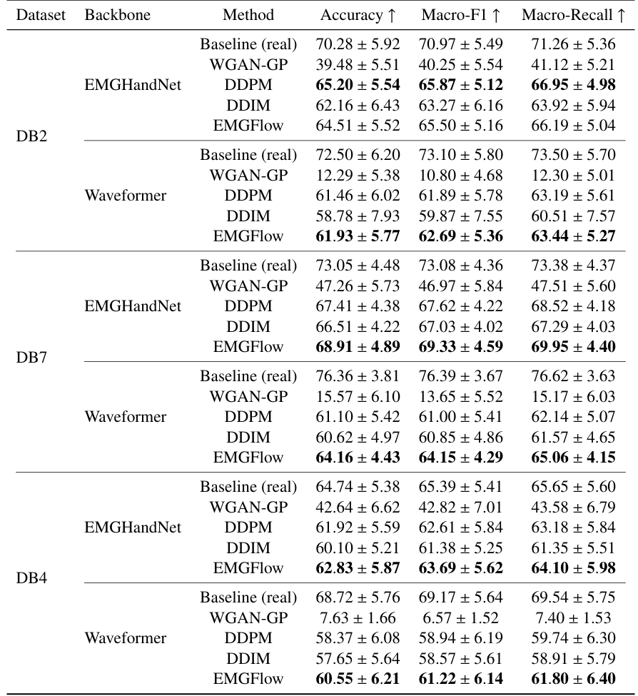
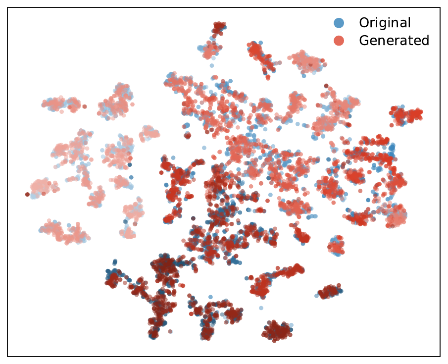
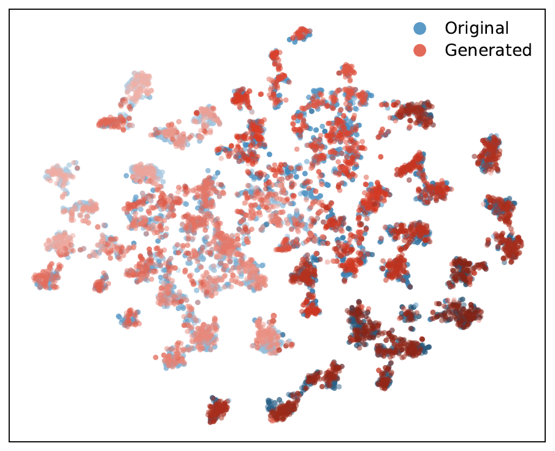
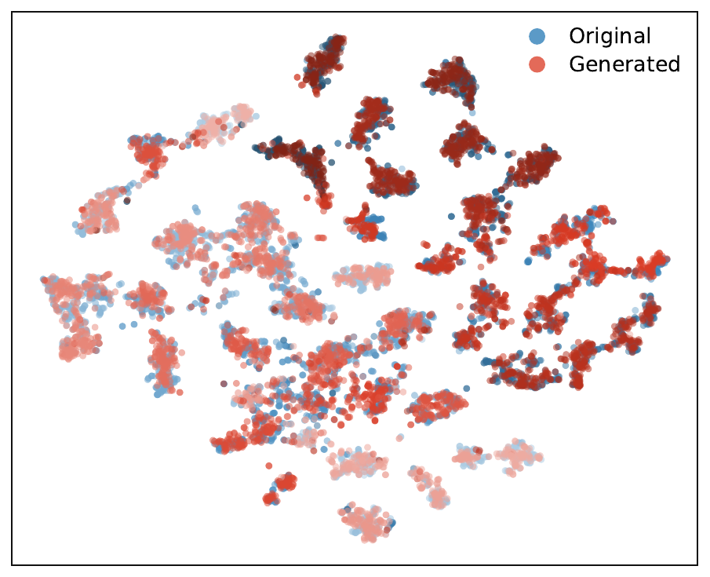
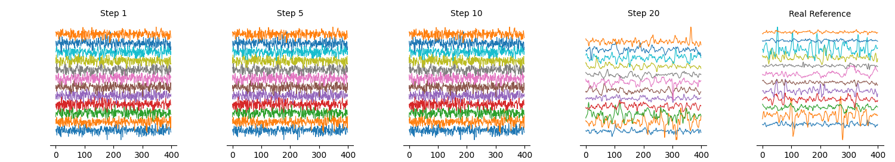

<div align="center">
<h1>EMGFlow</h1>
<h3>Robust and Efficient Surface Electromyography Synthesis via Flow Matching</h3>

[Boxuan Jiang](mailto:data.j@sjtu.edu.cn)<sup>1</sup>, [Chenyun Dai](mailto:chenyundai@sjtu.edu.cn)<sup>1 :email:</sup>, and [Can Han](mailto:hancan@sjtu.edu.cn)<sup>1 :email:</sup>

<sup>1</sup> School of Biomedical Engineering, Shanghai Jiao Tong University, Shanghai, China

(<sup>:email:</sup>) Corresponding Author

</div>

> This repository contains the public model release of our paper: **"EMGFlow: Robust and Efficient Surface Electromyography Synthesis via Flow Matching"**. The current branch focuses on the core generative modeling code for surface EMG synthesis, including **EMGFlow**, **DDPM/DDIM**, and **WGAN-GP** baselines.

## Overview

**EMGFlow** is a conditional generative framework for surface electromyography synthesis. It is designed to generate class-conditioned multi-channel EMG segments efficiently while preserving waveform fidelity, downstream utility, and practical generation efficiency.

In this work, we introduce **Flow Matching** to sEMG generation and benchmark it against representative diffusion and adversarial baselines under a unified evaluation protocol. The released code in this repository focuses on the core model layer of the paper:

- **EMGFlow** with conditional Flow Matching and ODE-based sampling
- **DDPM / DDIM** as diffusion baselines with a compact 1D U-Net backbone
- **WGAN-GP** as an adversarial baseline for generative comparison
- Shared utilities for **classifier-free guidance**, **EMA**, **attention**, **patch extraction**, and **sampling schedules**

<div align="center">

</div>

## Features

- 🌊 **Flow Matching for sEMG synthesis**, introducing continuous-time generative modeling to class-conditional EMG generation
- ⚙️ **Solver-flexible ODE sampling** that supports efficient generation and strong quality-efficiency trade-offs
- 🎯 **Classifier-free guidance** for controllable class-conditioned EMG generation
- 📈 **Strong synthetic-data utility** under both augmentation and TSTR evaluation settings
- 📦 Public release of the **core model implementations** used in EMGFlow

## Baselines

Three generative model families are included in this release and aligned with the paper's main comparison setting:

- **Flow Matching**: the proposed EMGFlow model
- **Diffusion**: **DDPM** and **DDIM**
- **Adversarial**: **WGAN-GP**

<div align="center">
  
</div>

The table below shows the **TSTR (Train on Synthetic, Test on Real)** results across datasets and classifier backbones, highlighting the standalone utility of synthetic EMG generated by different methods.

<div align="center">
  
</div>

## Datasets

EMGFlow is evaluated on three widely used benchmark sEMG datasets:

- **Ninapro DB2**
- **Ninapro DB4**
- **Ninapro DB7**

This public repository is a **model-only** release, so dataset files and preprocessing pipelines are not included in the current branch.

## Evaluation Protocol

To assess synthetic EMG quality from multiple perspectives, the paper evaluates generated samples under:

- **Fidelity metrics**, including feature-based quality indicators such as FID, IS, 和 CAS
- **TSTR (Train on Synthetic, Test on Real)** to measure standalone utility of synthetic data
- **Augmentation experiments** to measure how generated samples improve real-data training
- **Guidance and solver analyses** to study controllability and efficiency trade-offs


## Visualizations

### Generated Signal Comparison
The figure below compares representative real and generated EMG segments on DB7.

<div align="center">

</div>

### Distributional Alignment
We also include t-SNE visualizations on **DB2**, **DB4**, and **DB7**, showing that generated samples preserve the class-wise structure of real EMG features across datasets.

<div align="center">



</div>

### Guidance Sensitivity
The impact of classifier-free guidance on fidelity, standalone utility, augmentation benefit, and realism is illustrated below.

<div align="center">

</div>

### Generation Trajectory
We further visualize the generation evolution of a class-conditioned EMG sample under Flow Matching.

<div align="center">

</div>

---

## 📄 Citation
If you find this work helpful, please consider citing our paper:
```bibtex
@article{jiang2026emgflow,
  title={EMGFlow: Robust and Efficient Surface Electromyography Synthesis via Flow Matching},
  author={Jiang, Boxuan and Dai, Chenyun and Han, Can},
  year={2026}
}
```
## TODO

- Release a cleaner **experiment framework** for training and evaluation
- Open-source the **fidelity evaluation package** used in the paper
- Provide a finalized **requirements** file for reproducible setup
